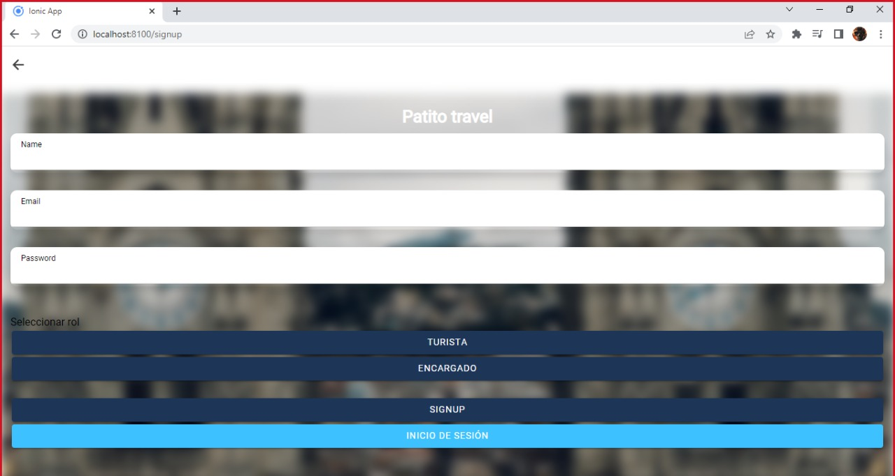

# Patito Travel
## Acerca del proyecto (Manual de usuario)
<div align="center">
    
</div>

Esta aplicación se ha creado con el objetivo de fomentar el turismo en Quito. Se ha desarrollado en el Framework Ionic.

La aplicación permite el acceso de tres roles, usuario turista, usuario propietario o encargado del sitio turístico y administrador general. El usuario encargado puede ingresar detalles del sitio turístico, el usuario turista puede ver todos los registros de los sitios ingresados y el administrador es capaz de eliminar los lugares que vea conveniente borrar. 

### Registro 
El registro de sesión cuenta con dos roles: Turista y Encargado 
<div align="center">
    
</div>

### Usuario Turista
El rol Turista al iniciar sesión puede ver los lugares turísticos que se han registrado y sus detalles
<div align="center">
    
</div>

Al ingresar en los detalles se pude ver la imagen del lugar, el nombre del local, nombre del dueño del local, la ciudad del sitio, detalles del local y la ubicación 
<div align="center">
    
</div>

Es posible modificar el perfil. A quí se presenta el rol, el nombre de usuario y el correo con el que se registró. Es el nombre de usuario el cual se puede cambiar
<div align="center">
        
</div>

### Usuario Encargado
Los encargados registrados en la aplicación tienen la propiedad de crear lugares turísticos con las mismas características de los detalles que ve el turista y la ubicación actual
<div align="center">
           
</div>

Al registrar un sitio y colocar la ubicación, estas se obtienen de la ubicación actual
<div align="center">
    
</div>

Al igual que el turista, el usuario encargado puede modificar su nombre de perfil 
<div align="center">
       
</div>

### Usuario Administrador
El administrador tiene la autoridad de eliminar cualquier lugar turístico registrado por los encargados. Se mostrará un mensaje de confirmación al momento de elimianr un sitio
<div align="center">
         
</div>

Este usuario también tiene la cualidad de modificar su usuario
<div align="center">
       
</div>

<p align="right">(<a href="#top">back to top</a>)</p>

### Sitio Web
Ionic permite la visualización en la Web
<div align="center">
    
</div>
<div align="center">
    
</div>
<div align="center">
    
</div>
<div align="center">
    
</div>
<div align="center">
    
</div>
<div align="center">
    
</div>
<div align="center">
    
</div>
<div align="center">
    
</div>
<p align="right">(<a href="#top">back to top</a>)</p>

### Herramientas
* [![Angular][Angular.io]][Angular-url]
* [![Ionic][Ionicframework.com]][Ionic-url]
* [![Firebase][Firebase.google.com]][Firebase-url]

## Getting Started

### Instalación (Manual de instalación)

1. Clona el repositorio
   ```sh
   git clone https://github.com/DanielGuachamin/proyecto-patito-travel.git
   ```
2. Instala las dependencias del proyecto
  	```sh
  	npm install 
  	```
 3. Levanta el servidor
 	```sh
  	ionic serve --lab 
  	```
## Anexos

Encuentra en el siguiente link como funciona la aplicación

* [Youtube](https://choosealicense.com)

Además contamos con una página web

* [Sitio Web](https://choosealicense.com)


El respaldo de la base de datos en una hoja de cálculo de Google

* [Google Sheet](https://choosealicense.com)

<p align="right">(<a href="#top">back to top</a>)</p>

<!-- MARKDOWN LINKS & IMAGES -->

[Angular.io]: https://img.shields.io/badge/Angular-DD0031?style=for-the-badge&logo=angular&logoColor=white
[Angular-url]: https://angular.io/
[Ionicframework.com]: https://img.shields.io/badge/Ionic-0769AD?style=for-the-badge&logo=ionic&logoColor=white
[Ionic-url]: https://ionicframework.com/
[Firebase.google.com]: https://img.shields.io/badge/Firebase-FFC300?style=for-the-badge&logo=firebase&logoColor=white
[Firebase-url]: https://firebase.google.com/
[product-screenshot]: captures/pantallaInicio.png
